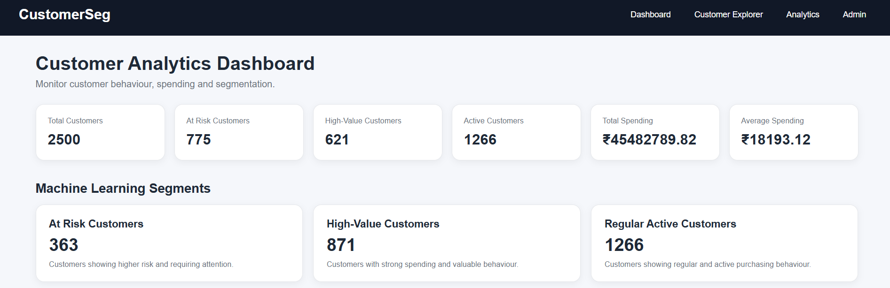
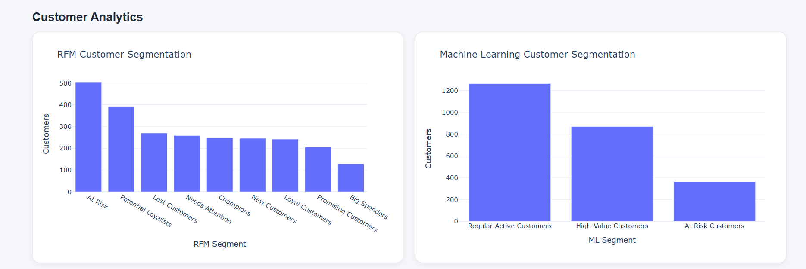
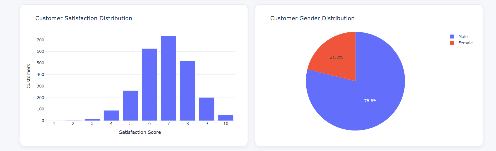
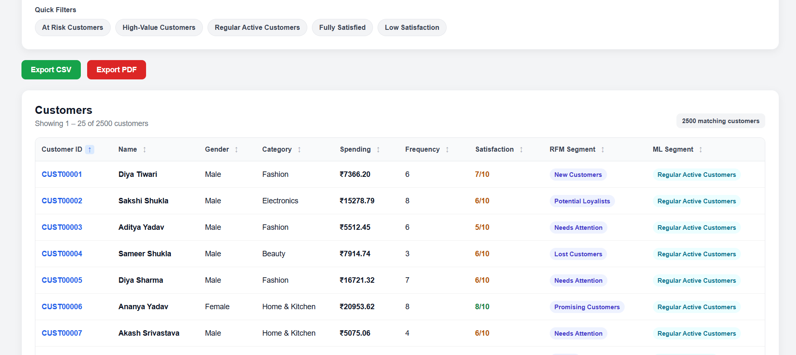
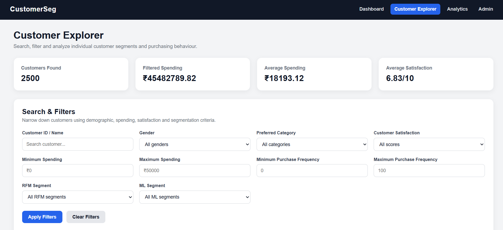
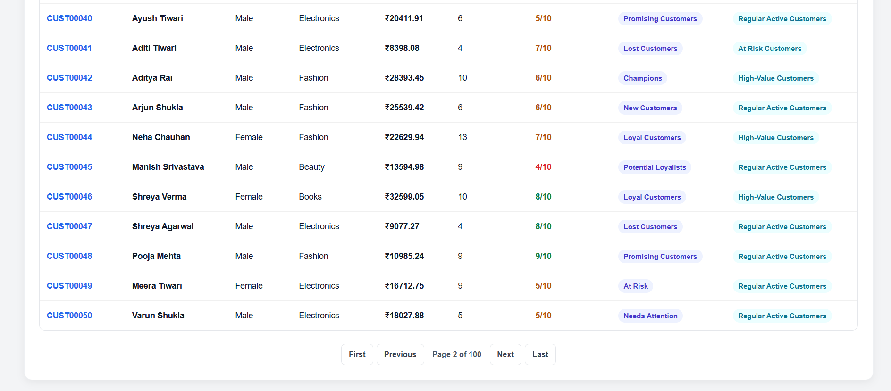
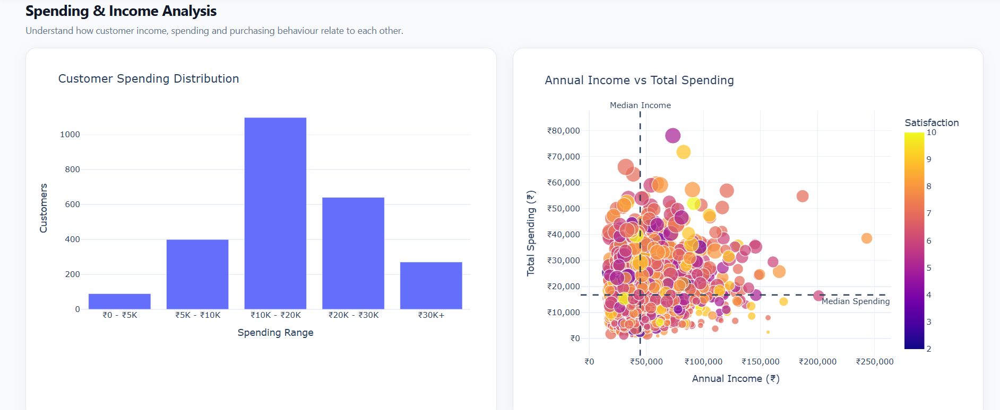
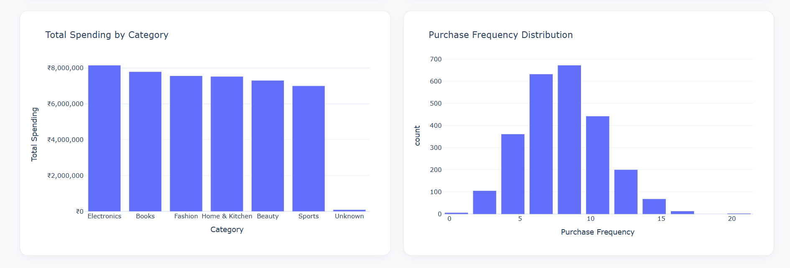
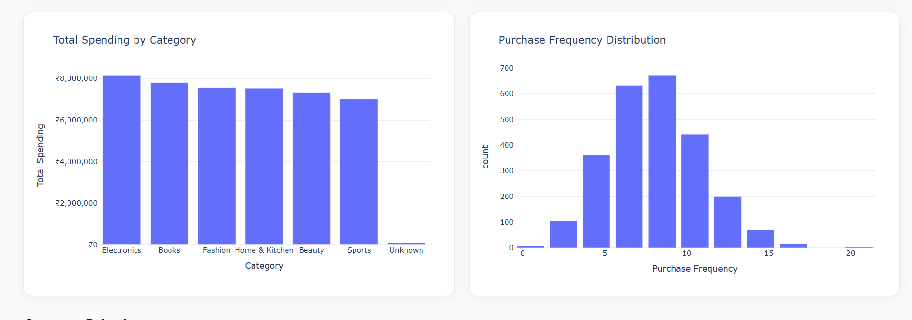
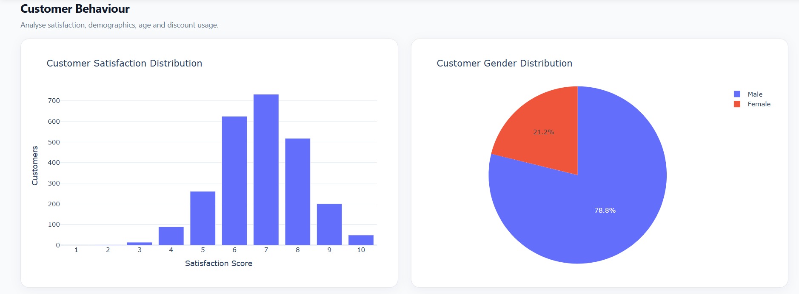

# CustomerSeg - Customer Analytics & Segmentation System


## Project Overview

**CustomerSeg** is a Django-based customer analytics and segmentation web application developed to analyze customer behaviour, identify valuable and at-risk customers, and support data-driven business decisions.

The system combines traditional **RFM (Recency, Frequency, Monetary) analysis** with **K-Means machine learning clustering** to divide customers into meaningful segments.

The application provides an interactive analytics dashboard, customer exploration tools, individual customer profiles, segmentation insights, and data export functionality.

---

## Key Features

* 📊 Interactive customer analytics dashboard
* 👥 Customer Explorer with search and filtering
* 🔎 Individual customer profile pages
* 📈 RFM-based customer segmentation
* 🤖 K-Means machine learning segmentation
* 🏷️ Automatic customer segment labeling
* 💰 Customer spending and purchasing behaviour analysis
* ⭐ Customer satisfaction analysis
* 🔄 Customer sorting and pagination
* 📄 CSV export
* 📑 PDF export
* 🛠️ Django Admin integration
* 🧹 Handling of missing customer data
* 📱 Responsive web interface
* 📊 Plotly-based analytics visualizations

---

## Customer Segmentation

### RFM Analysis

Customer behaviour is analyzed using three important RFM dimensions:

* **Recency** - How recently a customer made a purchase
* **Frequency** - How frequently a customer makes purchases
* **Monetary** - How much a customer spends

Based on these characteristics, customers are assigned meaningful RFM segments.

### Machine Learning Segmentation

The project also uses **K-Means clustering** to discover customer groups based on behavioural characteristics.

The resulting clusters are profiled and assigned business-friendly labels such as:

* **High-Value Customers**
* **At Risk Customers**
* **Regular Active Customers**

This combination of RFM analysis and machine learning provides both interpretable business segmentation and data-driven customer grouping.

---

## Analytics Dashboard

The main dashboard provides an overview of customer behaviour and segmentation.

It includes metrics such as:

* Total Customers
* Active Customers
* At Risk Customers
* High-Value Customers
* Total Spending
* Average Spending
* RFM Segmentation
* Machine Learning Segmentation

The dashboard also provides navigation to detailed customer and analytics pages.


*Dashboard overview — key metrics at a glance.*


*RFM segments vs. machine-learning segments, compared side by side.*


*Satisfaction score distribution and gender split across the customer base.*

---

## Customer Explorer

The Customer Explorer allows users to examine customers individually and collectively.

Available functionality includes:

* Customer search
* Segment filtering
* Machine learning segment filtering
* Spending-based sorting
* Customer satisfaction filtering
* Pagination
* Customer profile navigation


*Search, filter, sort, and export customer data — all from one screen.*

---

## Customer Profiles

Each customer has a dedicated profile page containing relevant information such as:

* Customer ID
* Customer name
* Total spending
* Purchase frequency
* Customer satisfaction
* Preferred category
* RFM segment
* Machine learning segment

This allows individual customers to be investigated in greater detail.


*Individual customer profile with key performance indicators.*


*Detailed RFM scoring and behavioural analysis for a single customer.*

---

## Advanced Analytics

The Advanced Analytics page provides deeper insight into customer spending, income, purchasing behaviour, satisfaction, demographics, and discount usage.


*High-level analytics summary.*


*Income vs. spending bubble chart — bubble size represents purchase frequency, colour represents satisfaction.*


*Spending broken down by product category, alongside purchase frequency distribution.*


*Age demographics and discount usage patterns across the customer base.*

---

## Data Export

The application supports exporting customer analytics data in:

* **CSV format**
* **PDF format**

This allows analysis results to be used outside the web application.

---

## Technologies Used

### Backend
* Python
* Django

### Data Analysis & Machine Learning
* Pandas
* NumPy
* Scikit-learn

### Visualization
* Plotly

### Frontend
* HTML
* CSS
* JavaScript

### Database
* SQLite

### Development Tools
* Git
* GitHub
* Python Virtual Environment

---

## Project Structure

```
CustomerSeg/
│
├── analytics/
│   ├── management/
│   │   └── commands/
│   │       └── import_customers.py
│   │
│   ├── migrations/
│   │
│   ├── services/
│   │   ├── cluster_evaluation.py
│   │   ├── cluster_labeling.py
│   │   ├── customer_insights.py
│   │   ├── ml_segmentation.py
│   │   ├── rfm_analysis.py
│   │   ├── segmentation.py
│   │   └── segment_insights.py
│   │
│   ├── templates/
│   │   └── analytics/
│   │       ├── analytics.html
│   │       ├── base.html
│   │       ├── customer_explorer.html
│   │       ├── customer_profile.html
│   │       └── dashboard.html
│   │
│   ├── models.py
│   ├── urls.py
│   └── views.py
│
├── config/
│   ├── settings.py
│   ├── urls.py
│   ├── asgi.py
│   └── wsgi.py
│
├── data/
│   ├── customers.csv
│   └── generate_dataset.py
│
├── screenshots/
│   ├── dashboard-overview.png
│   ├── dashboard-segmentation-charts.png
│   ├── dashboard-satisfaction-gender.png
│   ├── customer-explorer.png
│   ├── customer-profile.png
│   ├── customer-rfm-analysis.png
│   ├── analytics-overview.png
│   ├── analytics-income-vs-spending.png
│   ├── analytics-category-frequency.png
│   └── analytics-age-discount.png
│
├── manage.py
├── README.md
├── requirements.txt
└── .gitignore
```

---

## Installation and Setup

### 1. Clone the repository

```
git clone https://github.com/Skyscrappersam/customer-segmentation.git
cd customer-segmentation
```

### 2. Create a virtual environment

On Windows:

```
python -m venv .venv
```

Activate it:

```
.\.venv\Scripts\Activate.ps1
```

### 3. Install dependencies

```
pip install -r requirements.txt
```

### 4. Apply database migrations

```
python manage.py migrate
```

### 5. Import customer data

If the database needs to be populated from the included dataset:

```
python manage.py import_customers data/customers.csv
```

### 6. Run the development server

```
python manage.py runserver
```

Open the application in your browser:

```
http://127.0.0.1:8000/analytics/
```

---

## Main Application Pages

| Page | Purpose |
|---|---|
| `/analytics/` | Main analytics dashboard |
| `/analytics/customers/` | Customer Explorer |
| `/analytics/customers/<customer_id>/` | Individual customer profile |
| `/analytics/analytics/` | Advanced Analytics |

---

## Data Processing Workflow

The application follows this general workflow:

```
Customer Dataset
      ↓
Data Import
      ↓
Data Cleaning & Preparation
      ↓
RFM Analysis
      ↓
Customer Segmentation
      ↓
K-Means Clustering
      ↓
Cluster Profiling & Labeling
      ↓
Analytics Dashboard
      ↓
Customer Explorer & Profiles
      ↓
CSV / PDF Export
```

---

## Future Improvements

Planned or potential enhancements for future versions of this project:

* 🔐 User authentication and role-based access (e.g. viewer vs. admin permissions)
* 🌐 Deployment to a live hosting platform for public demo access
* 📉 Customer churn prediction using historical purchase trends
* 🔔 Automated alerts for customers shifting into "At Risk" or "Lost" segments
* 🧮 Configurable RFM scoring thresholds (currently fixed logic)
* 📊 Additional chart types (cohort analysis, retention curves)
* 🧪 Automated test coverage for segmentation and RFM calculation logic
* 🌍 Multi-currency support beyond INR
* 📱 Further mobile UI refinements

---

## Project Purpose

This project was developed as an individual academic/internship project to demonstrate practical implementation of:

* Web application development using Django
* Data analysis using Pandas and NumPy
* Customer segmentation using RFM analysis
* Machine learning using K-Means clustering
* Data visualization using Plotly
* Database management using SQLite
* Data export functionality
* Git and GitHub based project management

---

## Author

**Suraj Sharma**

GitHub: [https://github.com/Skyscrappersam](https://github.com/Skyscrappersam)

---

## License

This project was developed for educational and academic purposes.